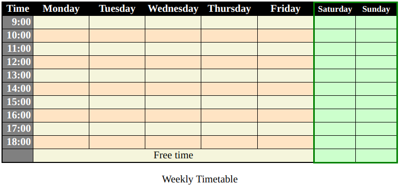

# Instructions

The index.html file in this repository contains a table with the days of the week and the working hours of the day. Edit the HTML and CSS files to produce the same layout is in the reference image.

## HTML
1. Create a caption "Weekly Timetable"
2. Create a `<colgroup>` with `<col>` or `<colgroup>` children to divide the columns into Time, Weekdays and Weekend
3. Add a footer to indicate that after 18:00 on weekdays there is Free Time

## CSS
1. Make the table fill the full width of the page
2. Use a fixed table layout to give all the columns the same width
3. Place the caption underneath the table
4. Make the Time column grey
5. Give the table head a dark background
6. Make the text of row and column headers white
7. Set `text-align: right` for all the numbers in the Time column
8.  Make the Weekend columns a very pale green
9.  Place a green border around the whole weekend section
10. Make the text for Saturday and Sunday smaller
11. Reduce the width of the Saturday and Sunday columns
12. Make the Weekday columns beige
13. Give the `td` elements in even-numbered rows a bisque background
14. Use `:not(...)` in your selector for even-numbered rows to prevent the `td` elements in the Weekend columns from adopting the bisque background
